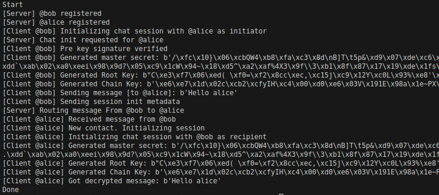

# TODO

* Add hmac verification
* Support different chain key per sender
* Change ephemeral key and recalculate root key and chain key when a response is received
* Drop used message keys


# Signal Protocol Example

Minimal implementation of signal protocol described in https://www.whatsapp.com/security/WhatsApp-Security-Whitepaper.pdf



## Run

```
python3 -m venv venv
source venv/bin/activate
pip3 install -r requirements.txt
python3 main
```